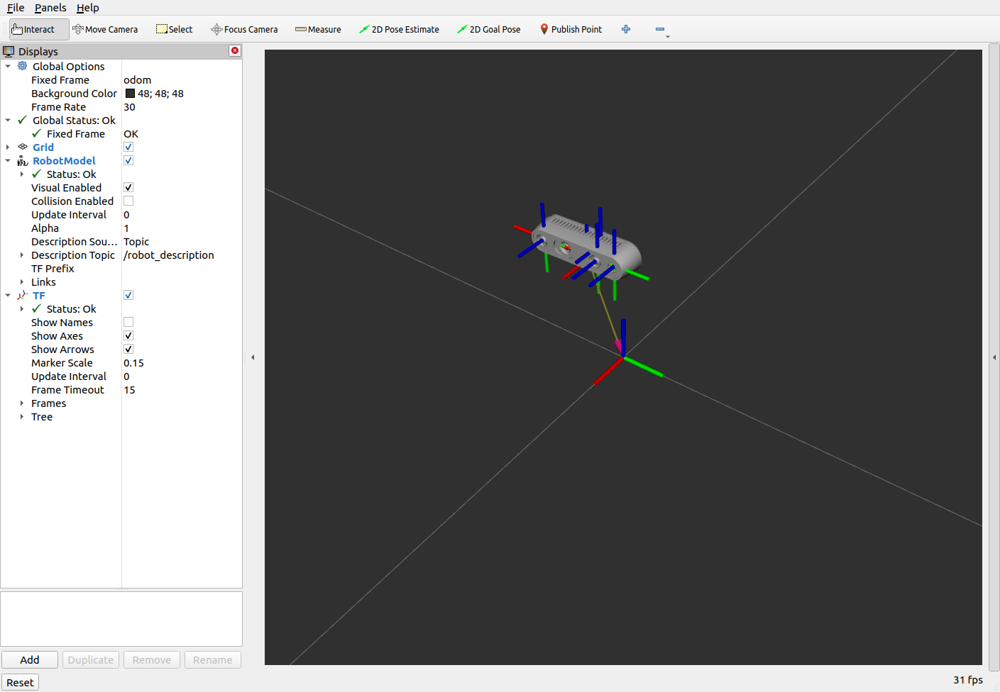

# isaac_ros_tutorial 

A set of tutorial to define and setup your docker for each package

Basic reference:
* [Isaac ROS GEMs](https://developer.nvidia.com/isaac-ros-gems)
* [Repositories](https://github.com/NVIDIA-ISAAC-ROS)
* [Jetson containers](https://github.com/dusty-nv/jetson-containers)

# Tutorial

* [01-argus_camera](01-argus_camera/README.md)
* [02-realsense_camera](02-realsense_camera/README.md)
* [03-zed_camera](03-zed_camera/README.md)
* [04-oakd_camera](03-oakd_camera/README.md) - **In draft**

# Install 

Follow the instructions to:

1. [scripts](scripts/README.md) folder
2. Install [isaac_ros_runner](isaac_ros_runner/README.md) on your Jetson

# View remotely

To install the robot description on your remote machine, follow the readme

* [remote_viewer](remote_viewer/README.md) folder

You will be able to see the an output like

# Pre-built Container Images

| Container tag                                 | L4T version |
|-----------------------------------------------|-------------|
| `rbonghi/isaac-ros-tutorial:isaac-ros-base`   | R32.6.1     |
| `rbonghi/isaac-ros-tutorial:argus-camera`     | R32.6.1     |
| `rbonghi/isaac-ros-tutorial:realsense-camera` | R32.6.1     |
| `rbonghi/isaac-ros-tutorial:zed-camera`       | R32.6.1     |
