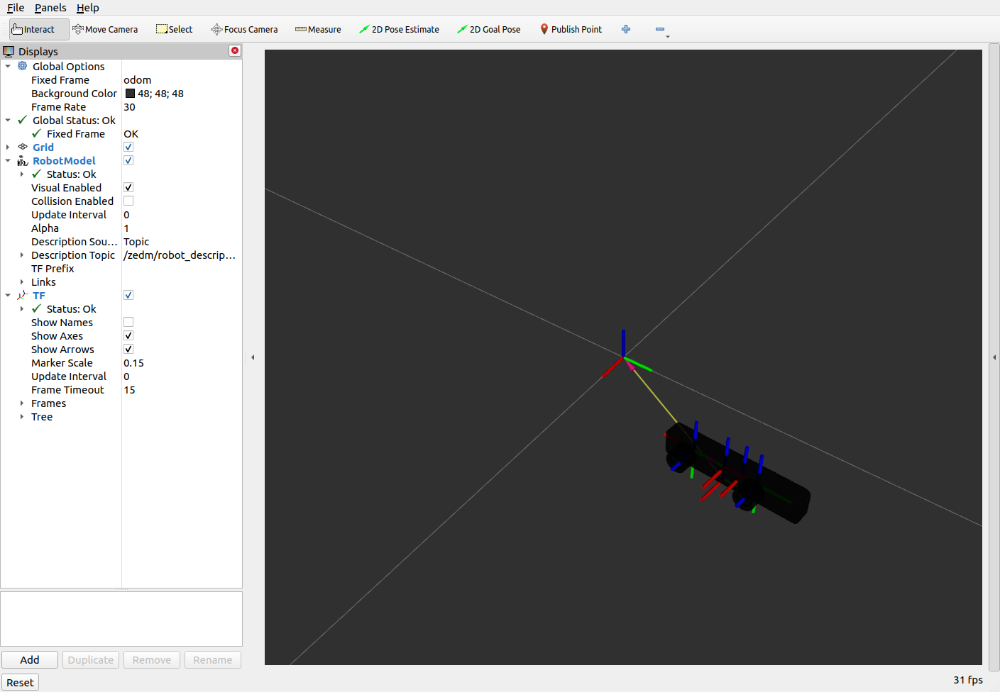

# Remote view

Install the minimal packages to run rviz2 and show the camera on board

# Install realsense ros2 package

build realsense ROS2 package

```
bash install_realsense.sh
```

## Run rviz2

```
source install/setup.bash
rviz2 -d remote_view.rviz
```


# Install ZED ros2 package

You need yo install the ZED SDK, if is missing on your desktop:

```
bash -c "$(curl -fsSL https://download.stereolabs.com/getzed)"
```

Build **zed-ros2-wrapper**

```
bash install_zed_wrapper.sh
```

## Run rviz2

```
source install/setup.bash
rviz2 -d remote_view_zed.rviz
```

